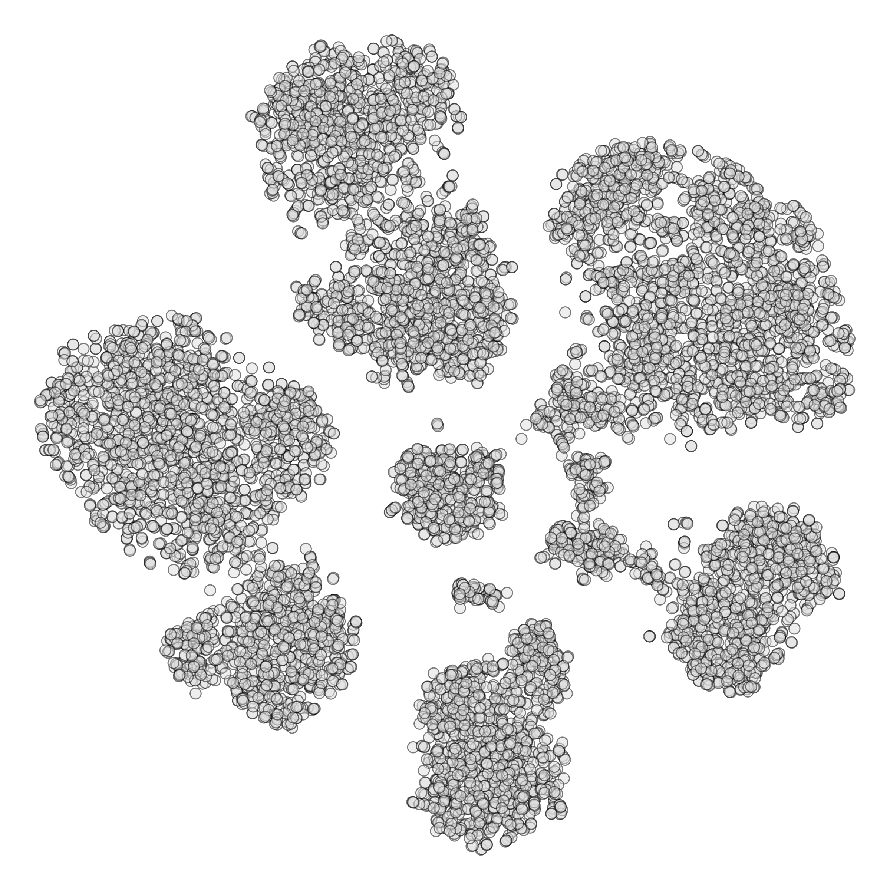

# CytoDA

This shinyApp facilitates the interactive analysis and visualisation of flow cytometry data, using common dimensionality reduction and clustering methods.

## Installation

```r
# install.packages('devtools')
devtools::install_github('JohannesSchroth/CytoDA')
```

## Usage

Once installed, you can run the app.

```r
CytoDA::run_app()
```
<p align="center">

</p>
